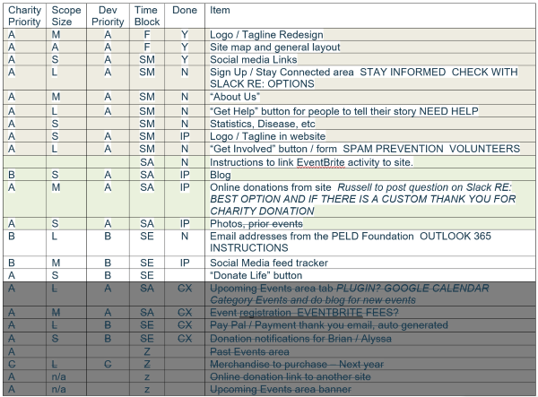
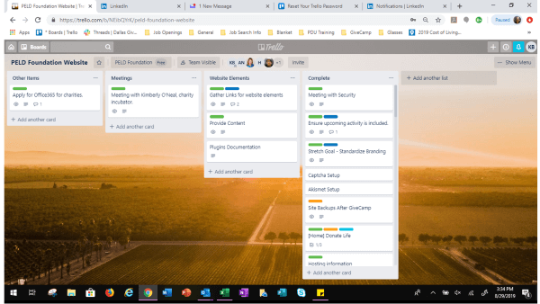

# Project Manager Info

## Suggested Timeline

> Be sure to attend the Volunteer Bootcamp and Kickoff Sessions.

- T-4 weeks - Requirements complete from your charity, keeping a close eye on the scope of the project to ensure that it is doable in a weekend. Please see your charities applications for requirements and feel free to confirm with Charity lead.

- T-3 weeks – Short, 30-minute call with your assigned charity to discuss what they want done at a high level, no technical discussions required - think business requirements. PM, BA, & charity are required.  

- T-2 weeks – 30-minute call to decide on technology and review scope of work. Get finalization on technology choice and agreement that the scope is attainable. Lead developer, UX, BA, and tech Jedi are required. If your charity needs hosting/database or other resources request them (see instructions below)

- T-1-week – 60-minute call to review scope, technology, and ask for individual ownership of tasks. PM should set up tracking & communication tools, if applicable. Lead Dev should set up production environment and DBs, if applicable, or done by your Tech Jedi. Encourage the team to brush up on any skills that they might need during the event weekend. All team members required.

- T-1 day – Touch base with the team and ensure everybody is ready for Friday night. Communicate any last-minute updates from the charity. 

## Getting Yourself Ready

The first step to starting a successful GiveCamp weekend is getting yourself prepared. It is a valuable service you are providing, and it falls on you to make sure all the donated time and resources are used in the most efficient way possible, in the limited time you have access to them.

It is hard work, but you can do it.

Start by getting yourself prepared. The charities have already done a lot of work getting their submissions ready. The GiveCamp staff has spent a lot of time and effort refining the tools and resources we must make you successful.

Spend time reviewing the documents and assets you already have BEFORE you reach out to the charity. Nothing will undermine your reputation with the charity faster than asking a question they have already answered one or two times on their initial application or long form. If you have questions regarding the application, please reach out to the [GiveCamp staff](mailto:contact@dallasGiveCamp.org).

> STOP: Before reading any further, get your Charities Long Form Application out and review it.

As you read, pay careful attention to what they are trying to accomplish, and what they are asking for. This will form the basis for all the rest of your planning. Making sure you can deliver what the charity needs so they can do more for the community. NOTE: There can be a difference between what they ask for and what they need. Sometimes the charity will need help translating what they are asking for in the application to what is realalistic for the event. Sometimes there are pre-requsites that the charity did not ask for, that are required to do what they need. 

### Tips on prepping for GiveCamp
- Start planning 4 weeks prior to event.  Key is to plan; the pace is fast.  
- Review your Charities long form, and be familiar with their mission, and what they are specifically expecting to get at the end of GiveCamp.
- Get to know the Charity you are helping beforehand, understand their work and message.
- Majority of the work we do is building a website or updating a website for charities. Research online if technology projects and/or website builds are new for you.
- Get all tasks laid out, as much as you can get set up do before hand. If you don’t you could waste a day on it. That is 50% of the GiveCamp time. Do it beforehand.
- Pre-discuss design of website with the UX.  Communicate with rest of team prior to weekend on what the template may look like.  This will give developers a starting point while the design is being finished up.  
- Focus on what you can get done in 12 hours x 5 people.  Friday will be a lot of prep, leaving all day Saturday, and half of Sunday to complete.
- Work with the charity to have all images/graphics/copy (i.e. words) for the website available, make sure developers are aware where that information is. Your options from worst to best:
  - Thumb drive: good to have as a fall back, but doesn’t scale, and will be hard to locate in the future.
  - Dropbox, Box, Google Drive or OneDrive: good if the charity already uses this, however the volunteers would need to be granted access
  - Slack: Files can be uploaded into the channel for your charity, all volunteers will have access to this. 
- During the weekend, communicate what problems are your team can help you resolve.  Get to know your team so tasks are appropriately assigned. If your team doesn’t know the answers reach out to the GiveCamp organizers, we are all in this together and we all want every project to succeed.
- If you use any tools that GiveCamp provides, like hosting through Everleap, get this set up before (TIP: the Jedis will do it if you ask them). 
- If you are not technical and need help, reach out to one of your team members to fill that role. Someone will need to connect to databases, server and do test deployments. Whoever does it, make sure everything is tested well before the start of the weekend.
- Communication – make sure people know what you need them to work on prior and get a status before the event.  
  - Communication with the team at least once a week.  
  - Communicate updates to charity rep.  Ensure they know when to be where for the event.
  - Start meeting about a month before.  As soon as you get the team assignments and have the charity intros, start meeting.
  - Detail requirements prior to the weekend

## Working with the Charity 

You want a chance to be a hero in real life. 

Well this is it.

You are about to achieve something your charity can only dream of. They may make amazing things happen in your community and do things with their life that you would never be able to make the sacrifice to do. You are going to be performing a potentially course altering project that will impact the trajectory of their story from this point forward. That is awesome.

To work with them effectively there are two things you will need to focus on.
1. **The Relationship**. Don’t sell this short. Make sure you get to know them and their mission. They are passionate about it, and you should make sure you develop some real passion about it as well. Someone you know may come to depend upon their services soon. Take time with them and make sure you understand what they need and want.
1. **The Scope**. This is always the biggest challenge. Keeping the scope manageable and communicate that clearly. They won’t know what is possible, and what they see as valuable often will not have a direct correlation to what is hard or easy. They may get a lot of value out of a simple change and may only get a small bump from something that is very hard to do. But remember this: **Disappointment isn’t possible without first having incorrect expectations**. Whatever scope you commit to delivering, make sure your charity has the correct expectations all the way along. Don’t over commit, we only have 1 weekend.

### Work directly with the Charity representative:
- Meet with Charity rep prior to GiveCamp: gather requirements and have a clear understanding of the plan prior to GiveCamp weekend.  Define as much website content as possible.
- Break all the things they have asked for into buckets, at some point you may need to start trimming the scope. Know what you can cut. And when you are planning to do the work, make sure you are not spending hours on an "optional" item when a "must have" is being neglected:
  - Must have
  - Really Want
  - Nice to have
  - Optional if easy
- Know when and how long they will be onsite during the weekend.
- Know how to get a hold of them or someone on their team during the weekend in case you have an urgent need for information or clarification.
- Be the conduit between the charity and developers, make the lines open where developers can have direct contact if needed.
- If possible, meet before GiveCamp and review the design with the developers
- Remind the Charity rep to be available that weekend either onsite, email, phone, IM.  This will also provide the Charity training to use the tool. Additionally, scope can change, there is need for ad hoc mtg. 

## Working with your Team

Your team is taking away a full weekend from their friends and family to donate time to complete strangers. 

That is awesome. Make sure you remind them of that fact.

> SAFETY FIRST: Keep in mind that team members come from all over the DFW area. Consider drive times when staying late & meeting early. We want to be productive, but volunteer safety is important. 

What they will need most of all is for you to fill two roles. 

1. **Direction**: Assign and Manage tasks: The first role is to manage the work and keep track of tasks. Make sure everyone is busy, has tasks and is adding value. The timeline for GiveCamp is very compressed, and if you are pulling late nights energy can wane and emotions flare up. An engaged developer that can stay heads down doing what they do best is a happy developer. Keeping tasks balanced and everyone engaged is almost like running an agile project with 3-hour sprints.
1. **Air Cover**: Clear up questions and clear roadblocks. Invariably there will be questions, debates, and issues with technology. As the PM, you need to take those on and handle them, or risk the entire team burning time they don’t have to spare. If you have been diligent about getting all the development and deployment tools tested before the weekend, then this should be minimized. 

### High Level Agile Overview for Dallas GiveCamp

#### Scrum Roles
There are three Core Roles in Scrum: Product Owner, Scrum Master, and Scrum Team.  At GiveCamp the Project Manager is the Product Owner and Scrum Master.  Developers and Designers make up the Scrum Team.

The Non-Core Roles include customers and users.

#### GiveCamp PMs
PMPs are used to managing every aspect of the project. Scrum teams manage their own workload.  I did not realize this my first year.  The Agile PM is still a critical role, especially at GiveCamp since the pace is so fast during the weekend.  We facilitate discussions and ensure the customer and developers understand each other.  We also help keep everything on schedule and reprioritize throughout the weekend if needed.  

#### Self-organized teams
Scrum believes that today’s workers have much more just technical knowledge and that they deliver greater value when they manage themselves and their workload.

#### Collaboration
In Scrum, software development is a shared process that needs everyone working and interacting together to deliver a great product.  

#### Sprints
Work is organized into specific work periods called Sprints.  The Scrum Team chooses the work they can complete in a Sprint and will work with the PM and customer to determine what work will be done and when.  The team meets daily monitor activity in order to stay on track.

In typical Scrum projects a Sprint lasts 30 days.  At GiveCamp the Sprints are 3 hours.  

#### Time-boxing
GiveCamp is incredibly fast paced!  It is very important to know ahead of time what the charity wants to accomplish and what the team is able to do.

Friday evening within the first hour three things should be accomplished.  1) Review what the charity wants to accomplish and the team’s capabilities.  2) Prioritize the charity’s wish list for what can be accomplished and any stretch goals. 3) Time box each item so the team knows what needs to be accomplished in each 3-hour Sprint.

I call our Sprints "FE" for Friday Evening 6-9 pm, "FN" for Friday Night 9-midnight, "SM" for Saturday Morning 8-11 am, "SA" for Saturday Afternoon 12-3 pm, "SE" for Saturday Evening 4-8 pm (includes dinner), "SN" for Saturday Night 8-11 pm, and "SU" for Sunday 9-noon.

  Here is an example of the time boxing exercise that one team did:
  

#### "Daily" Scrum
This meeting is every three hours at GiveCamp and covers three basic questions for each team member.  
1. What did I accomplish in the last work session.  
1. What do I plan to accomplish during this work session.  
1. Are there any issues that may prevent me from completing my work.


### Tips and Tricks for working with your team
- Test all the tools before the weekend
- Confirm role expectations for each member prior to the weekend, to ensure they understand and can complete their responsibilities. 
- Meet with your team or have conference calls before the weekend, so they can understand the scope and design of what they are doing.
- If they have concerns about the scope, or design, get those resolved before the weekend.
- Understand each team member’s experience and how it can be best utilized during GiveCamp
- Get people to commit to what hours they will or won’t be there. This is a weekend where someone will have tickets to something, or a kid’s soccer game that they cannot miss. Figure that out before the weekend, and let the staff know if you will be "down a man" for the weekend and we can assign more resources.
- Have the UX design finalized well before the weekend, and make sure you have access to all the design resources and image files.
- This project is too short to use many online tools for tracking progress, and everyone is in the same room. Some teams have had success using a tool like Trello or Azure DevOps Boards, but you can also just use white boards or easel pads to put critical information where everyone in the room can see it. Feel free to grab a piece of large paper, write the tasks and name assigned to them on it, and hang it on the wall. Mark through it when done. The important thing is that "what hast to be done" and "who is doing this" needs to be crystal clear. **At the end of the day use the tool that the team is comfortable with online or on paper.** 

  Here is an example of a Trello board from a past GiveCamp:
  

- Have frequent breaks for food and status. GiveCamp does a good job of feeding developers, force them to take small breaks for food. Have progress checks right before or after a meal break.
- Use your team’s expertise. They are experts, if you have a problem, ask them what they think. If there is a clear consensus on the path forward, go with that. If they are divided, then you make a call and press on. If you need more data or opinions, give them something to work on and track down the onsite staff.

## Working with the Design

Many of your projects will be something like this: 

```
"We need an updated website that works on mobile and is easier to update"
```

There is a lot of charities and small businesses that are stuck in a model where they have a service provider that has the login to their site, and in order to get changes to the site they must send the changes to them and wait for them to login and make the changes.

It is common, and the most widely accepted answer is to move them to something like WordPress and put a custom theme on the site. This in most years is the bread and butter type project for GiveCamp.

To make this effective, make sure you have a UX resource on your team, and make sure they work with the charity to understand their brand, colors, current site content and future content they are planning to add.

The UX pro should be able to handle all the details, designing the navigation structure, picking an appropriate starter theme, and identifying the changes to make for that theme to be "on brand" for your charity.

Often, they will also create a new or refreshed logo for the charity.

### Tips and Tricks for working with the design
- Make sure you validate that WordPress will work. Note: issues can arise when too many admins are accessing the admin page at the same time
- If the Charity uses joomla, drupal, phpnuke, DNN, sitefinity or other CMS and they are happy with it, make sure the UX Designer knows that.
- Get copies of all the image assets.
- Make sure to get the colors documented, preferably as hex codes for the CSS.
- Make sure if a theme is used, you have the entire zip file.
- If the UX Designer will not be on site for the weekend, make sure you know how to get a hold of them. There always seems to be one more image slice, or a slightly different version that is needed at the last minute.
- Don’t let perfection be the enemy of good enough. The team will likely have the skills to get the site pixel perfect with the designers vision, however, if they can get 80% close in 1 hour, and then move on to something else, ask yourself if completing that other task would add more value to the charity. 

## Working with the Technology

Obviously, the success or failure of your weekend will depend largely on you and your team’s ability to get the technology the charity needs, acquired, deployed, configured, and populated with correct content. Many GiveCamp project involve some level of data migration or content remastering. Rarely do they come to GiveCamp with NO website or email.

There are two main areas to focus on here:

### The current site

You need to know how to get to everything your team will need. That is at a bare minimum the location and credentials for the following:

   1. Registrar - where they purchased their domain name
   2. Nameservers - servers that map the domain name to an IP address, typically the same as the registrar or the host
   3. Host - the company operating the web servers the site is running on
   4. Content Delivery Network or CDN (if used) - caches web content between the host and the users browser
   5. Website
   6. FTP
   7. Database
   8. Email
   9. social media accounts

### The New site

There are some great free assets and donations that are being made available for the charities that participate in GiveCamp. I mean who could not use lifetime free webhosting. That is sweet make sure that is all set up before the weekend.

If they are moving to a new CMS, it may be faster to just copy and paste, or copy and then edit and then paste the "remastered" content into the new system. 

### Tips for working with the technology
- Your team will know what they need. Make sure you cover it in detail in the meetings before the weekend.
- Put all the credentials in one place, perhaps slack. Have a spreadsheet and have one sheet for the old and new.
- Make sure you validate all the logins prior to the weekend. And in case something changes, double check everything the week before GiveCamp.
- Take backups of what is currently there.
- Work on your new site, and make sure all the bugs ae ironed out PRIOR to making any DNS changes.
- If you are changing DNS settings remember that depending on how the charity is setup this might impact email settings. Triple check this. 
- Unless it is a new domain name, it is best to give the charities final approval on the new site before you make the DNS changes, as these changes will break there old site, and we want to make sure they are happy with the new site before breaking their old one. Remember "do no harm"
- The team should be able to do all the development on the new site using the temporary URL provided by the hosting company. Remind them NOT to hard code this temporary URL into the code/CMS, use relative paths.
- Define project dependencies prior to GC
- If you are rolling out a new CMS, make sure the developers take advantage of the Pluralsight courses for it before the weekend.
- Also, be sure to account for training the charity on how to update their site, social media etc.
- If you have content to upload, If the charity is on site you can help them do that, it will give them a chance to work with the new site, help you find bugs, and provide a good real-world training scenario.
  
## Working the Weekend

Showtime. The GiveCamp weekend is where all your hard work and preparation will pay off. It will seem crazy at times, and when you explain it to people they may not get it. But it will be a memorable weekend, and if done right will move the world towards being a better place. Some important things to keep in mind:

**The schedule**. That is really it. Make sure you are on target, and if you are not, let somebody know right away. You must make things happen fast if anything starts trending the wrong way.

- Be ready to hit the ground running, build databases, install WordPress, and make sure IIS is working. 
- Know when food is going to be served and plan out tasks and breaks accordingly.
- Have regularly planned status updates, this will vary by team, but if you sense a lull, have a team huddle.
- Start deploying code as soon as possible.
- Test and deliver as you go, work with your team on how that will work.
- Try to have all the code done before the end of Saturday.
- Use Sunday for fighting bugs, moving content, tweaking the UI, training the charity, and getting the summary deck ready. Plan to nap on Sunday.
  
  > But above all STAY ON SCHEDULE and priortize what adds the most value to the charity. 

### Manage the following during the actual weekend
- Tasks - White Board, post-its, Trello; pre-defined for the most part based on prep
- Risk & Issues - having the person with charity present, talk directly or have a way to contact with them to get things worked out or need a work around.    
- Risk management - use something you are familiar with and comfortable with.  Track on whiteboards, or post-its
- Timeframe - Stick to a defined scope and understood what can’t be accomplished. Think Minimal viable product, then enhance.
- Testing - Developers and Charity rep should test as work is complete (a great way to help the charity rep learn how to use the site)
- Communications - deliver clear expectations 
- Escalations - Reach out to GiveCamp Organizers & Tech Jedi’s as needed. Don’t waste a lot of time spinning your wheels.
- Coordination - huddle and use whiteboard
- Delivery - Don’t wait to Sunday afternoon to do one big bang push. You don’t want to find out Sunday afternoon that you are missing something and cannot deploy. Publish often.
- Quarterback the delivery but it should be true team effort with everyone engaged and communicating
  
### Common challenges and how to prepare for them

- Bandwidth - Wi-Fi can get overloaded and might not be able to handle workload from the teams. On the first day everyone syncing and loading.  At the end everyone is trying to do last minute uploads.  Plan.
- Keep it simple – Remember that the charity is going to need to own this project starting the Monday after GiveCamp and you have a very limited time and resources to get the project done. Do you best to keep the developers focused on the "minimal viable product" before starting any "cool ideas" or nice to haves. 

### Lesson learned from past GiveCamps
- Make sure Website available and domain temp-name set up. Complete DNS transfer after the charity has approved the new website. Sometimes it is a good idea to wait till after GiveCamp to complete the DNS transfer, work with the Tech Jedi if this is the case. 
- Group requirements by the section (page) of the website that they belong on, this will make it easier to divide the work between the team members. Notify event staff if you feel your team is understaffed.
- Group assets by the section (page) of the website that they belong on. Assets are images, copy (text), etc. 
- Upfront training is available on the technology being used.  We have Pluralsight resources the teams can use to get upfront training on WordPress, Joomla, Drupal or whichever CMS is being used. 

## The Details

Ensure completion of each of the tasks below, you may delegate these tasks to members of your team, however please stay on top of them to ensure they have been completed.

### Requirements

Each charity has provided GiveCamp with a word document containing preliminary requirements. 

- Task: Prior to the event speak to the charity and confirm all the details of what needs to be completed during the GiveCamp weekend. Gather everything you need from them (images, text, etc.). We only have 2 days to complete this work. Be sure to be upfront with the charity with how much work can be done in this amount of time. Prioritize requirements with charity so that the "must have" tasks get done first. 
- Don’t forget to collect information about any existing systems. 
  - Do they currently have a hosting account? Where? What are the credentials?
  - Where do they host their email? If we move them to Everleap will this break?
  - Where is there domain name registered? What are the credentials (they will need to provide one if they require a website)?
  - Use standard requirements list from GiveCamp.  Discuss colors, logos, web-sites comparable, sponsorship and pictures to be on websites. Mostly waterfall due to time, pages should be divided amongst the team.  Graphic designer will work with team.
  - New website need lots of text.  Charities need to supply that. Preferably, before the start of the weekend. 
  - Drawings are helpful.  UX community folks helped some teams in advance to build out a proto type.  Create wireframes in advance.  Other things like this in advance. 
  - You HAVE TO HAVE user names, passwords, DNS settings, mail server settings, word press logins etc.  Must test these in advance before the weekend.  
- Ultimately the charity will be responsible for any information they put on the web but be careful what information we agree to collect on the web. Since we cannot audit or guarantee the security of the applications that we are working on it is a good idea to avoid collecting things like physical address, credit card numbers, etc. 
- When collecting items such as images from the charity, please confirm with them that they have the rights to use them on the website. Please also ensure that the team doesn’t use anything that is not licensed appropriately (software, pictures, etc.).

### Content Management System (CMS)

Most charities requirements are for a basic brochure type website (home, about us, contact us, etc.). Additionally, one of our main goals of GiveCamp is to leave the charity with something they can maintain without the help of a developer. To that end in many cases we want to implement a CMS for them. There are many CMS’s available, however we strongly recommend using WordPress, unless the charity has a specific reason not to. We recommend this because WordPress has thousands of modules, templates, etc. available that will greatly speed your development time. Additionally, it provides an easy to use web interface so that the charity can maintain the site on an ongoing basis.

- Most GiveCamp charities select WordPress as there CMS.
- In your first meeting charity and see if they have any technical need to pick one CMS over another. Also speak to the team to see if you have any experts about any given CMS. Select a CMS and email your choice to pm@dallasGiveCamp.org
- After a CMS is selected – email the entire team letting them know what CMS was selected and recommend they get familiar with it prior to the event. The developer section of the handbook includes information for the developers on how to create a local copy of WordPress they can use for learning. 

### Hosting

Everleap has donated a hosting plan for each of the charities forever. If your charity needs hosting and wants to take advantage of this offer you must email charity@dallasGiveCamp.org and provide the following information:

- Name of Charity
- Physical address of Charity
- Email address contact for Charity
- Phone number for Charity Representative
- Do you want your site preconfigured with WordPress? – Yes or No

Once we’ve setup your Everleap account and WordPress (if requested), we’ll provide the relevant account information back to you.

> NOTE: Part of the deal we have with Everleap is that we put footer thanking them on the bottom of the site. The developer section of the handbook, includes the technical details. 

### Documentation

You want to make sure that you provide a list to all the resources that you used in the application, for example

- Where is the site hosted, what are the credentials to login?
- Where is the source code, what are the credentials to login?
- How does an administrator login to the website?
- List of what modules you installed
- Anything you would want to know if you were to have to maintain the website.

> Very successful teams will write documentation on HOW the charity can make updates to the site **as** they build out the features. Having the charity review this document and practice making updates to the site during the weekend is ideal. 

If you want to take screenshots or record videos for the documenation, take a look at the following tools:

- [Windows Snip & Sketch](https://www.windowscentral.com/how-use-snip-sketch-take-screenshots-windows-10-october-2018-update) - Free
- [Windows Steps Recorder](https://www.lifewire.com/what-is-steps-recorder-psr-2625976) - Free
- [ShareX](https://getsharex.com/) - Free in Windows
- [Greenshot](https://getgreenshot.org/) - Free on Windows, $2 on Mac
- [Jing](https://www.techsmith.com/jing-tool.html) - Free download - NOTE: they are working on a new tool to relplace this. 
- [Snagit](https://www.techsmith.com/screen-capture.html) - Windows or Mac Paid
- [Camtasia](https://www.techsmith.com/video-editor.html) - Windows or Mac Paid

### Presentations

On Sunday afternoon you will be giving a **5-minute** presentation to everyone at GiveCamp. We want to know about the great work your team did, but we also want to be respectful that everyone has had a long weekend.

- You and the members of your team should track the number of hours they worked on the project. You will need to submit this tally along with the PowerPoint file. 
- You need to email the presentation as a MS PowerPoint file at 1 PM to [pm@dallasGiveCamp.org](mailto:pm@dallasGiveCamp.org).
- Presentation should include the following
 - Thank you to team and charity
 - Brief explanation of what the charity asked for
 - Before pictures of what they had
   - NOTE: it is important that you capture this before the weekend, as you might not be able to get it after the weekend. 
   - See [here](/pm#documentation) for info about tools to take screen shots.
 - After pictures showing what you did
 - The presentation should be 3 slides
   - Before – what they had before
   - After – what they had after
   - Value – what value did the charity get 
